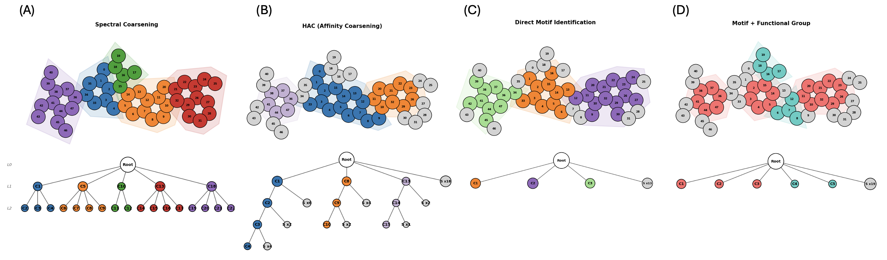

# Visualize Graph Tokenization Schemes

This document describes the graph tokenization systems and how to visualize them.

## Overview

MOSAIC provides four tokenization schemes for converting graphs to sequences:

| Scheme | Description | Key Feature |
|--------|-------------|-------------|
| **SENT** | Flat random walk with back-edges | Simple, baseline |
| **H-SENT** | Hierarchical with explicit partition blocks | Interpretable structure |
| **HDT** | Hierarchical DFS with implicit nesting | ~45% fewer tokens |
| **HDTC** | Compositional with functional groups | Guarantees chemical motif preservation |

## Visualization

### Quick Start: Compare Tokenization Schemes

```bash
conda activate mosaic

# Compare SENT, H-SENT, HDT, and HDTC on a molecule
python scripts/visualization/visualize_tokenization.py --name cholesterol --output-dir ./figures

# Run demo with complex molecules (cholesterol, morphine, caffeine, penicillin)
python scripts/visualization/visualize_tokenization.py --demo --output-dir ./figures

# List available molecules
python scripts/visualization/visualize_tokenization.py --list
```


### Visualization Panels (2x2 Layout)

The comparison shows four panels in a 2x2 grid:

| Panel | Description |
|-------|-------------|
| **(A) H-SENT** | Community structure with cross-community edges (spectral coarsening) |
| **(B) SENT** | Random walk traversal with visit order on nodes |
| **(C) HDT** | Hierarchical tree with bidirectional parent↔child arrows |
| **(D) HDTC** | Two-level functional hierarchy with ring/functional group communities |

H-SENT and HDT share the same spectral coarsening so their community assignments are consistent.

### Generation Demo

Visualize step-by-step molecule generation with animated GIFs. Uses Hydra
configuration (`configs/generation_demo.yaml`) with per-model entries for
checkpoint path, tokenizer type, and labeled graph settings.

Each tokenizer type has a specialized visualizer:

| Tokenizer | Side Panel | Features |
|-----------|-----------|----------|
| **SENT** | None | Random walk phase tracking |
| **H-SENT** | Block diagram | Partition fill bars, bipartite arrows |
| **HDT** | Abstract tree | Community hierarchy, current-community highlight |
| **HDTC** | Typed abstract tree | R/F/S type labels, type-based coloring |

All tokenizers support motif detection (ring and functional group highlighting)
via `FunctionalGroupDetector`, with progressive reveal as atoms/edges appear.

```bash
# Default: generate with models listed in configs/generation_demo.yaml
python scripts/visualization/generation_demo.py

# Override generation settings
python scripts/visualization/generation_demo.py generation.num_samples=5 animation.fps=3

# Change output directory
python scripts/visualization/generation_demo.py output.dir=outputs/my_demo

# Disable motif highlighting
python scripts/visualization/generation_demo.py motif.enabled=false

# Single model override (HDTC example)
python scripts/visualization/generation_demo.py \
    'models=[{name: my_hdtc, checkpoint_path: outputs/train/hdtc/best.ckpt, tokenizer_type: hdtc, labeled_graph: true}]'
```

### Community Structure Comparison (4 Coarsening Paradigms)

Compare four coarsening paradigms on the same molecule, each shown as a row
with molecule graph (left) and hierarchy tree (right):

| Row | Paradigm | Coarsener | Description |
|-----|----------|-----------|-------------|
| **(A)** | Spectral Coarsening | `SpectralCoarsening` | Data-driven spectral clustering, no chemical knowledge |
| **(B)** | HAC (Affinity) | `AffinityCoarsening` | Hierarchical agglomerative clustering |
| **(C)** | Direct Motif | `MotifCommunityCoarsening` | Ring-based union-find, preserves ring motifs |
| **(D)** | Motif + Functional Group | `FunctionalHierarchyBuilder` | Rings + functional groups + singletons |

Colors are aligned between the graph and tree panels in each row. Row (D) uses
type-based coloring: red = ring, teal = functional group, gray = singleton.

Both scripts include predefined molecules at two scales:

| Scale | Examples |
|-------|----------|
| **Drug-like (MOSES)** | cholesterol, morphine, caffeine, aspirin, ibuprofen, dopamine, penicillin_g, estradiol, quercetin |
| **Natural products (COCONUT)** | strychnine, camptothecin, artemisinin, vinblastine, reserpine, taxol, erythromycin |
| **COCONUT diverse** | coconut_furanone, coconut_flavone, coconut_isoflavone, coconut_chromene, coconut_sesquiterpene, coconut_glycoside |

By default (no arguments), the script runs on a list of COCONUT-scale natural
products: vinblastine, reserpine, strychnine, coconut_sesquiterpene.

```bash
# Default: run on COCONUT molecule list
python scripts/visualization/compare_community_structure.py --output-dir ./figures

# Specific named molecule
python scripts/visualization/compare_community_structure.py --name morphine --output-dir ./figures

# COCONUT-scale natural product
python scripts/visualization/compare_community_structure.py --name vinblastine --output-dir ./figures

# Custom SMILES
python scripts/visualization/compare_community_structure.py \
    --smiles "CC(=O)OC1=CC=CC=C1C(=O)O" --no-show
```


## References
- [HiGen: Hierarchical Graph Generative Networks](https://arxiv.org/abs/2305.19337) - Hierarchical decomposition approach
- [AutoGraph](https://arxiv.org/abs/2306.10310) - SENT tokenization scheme
