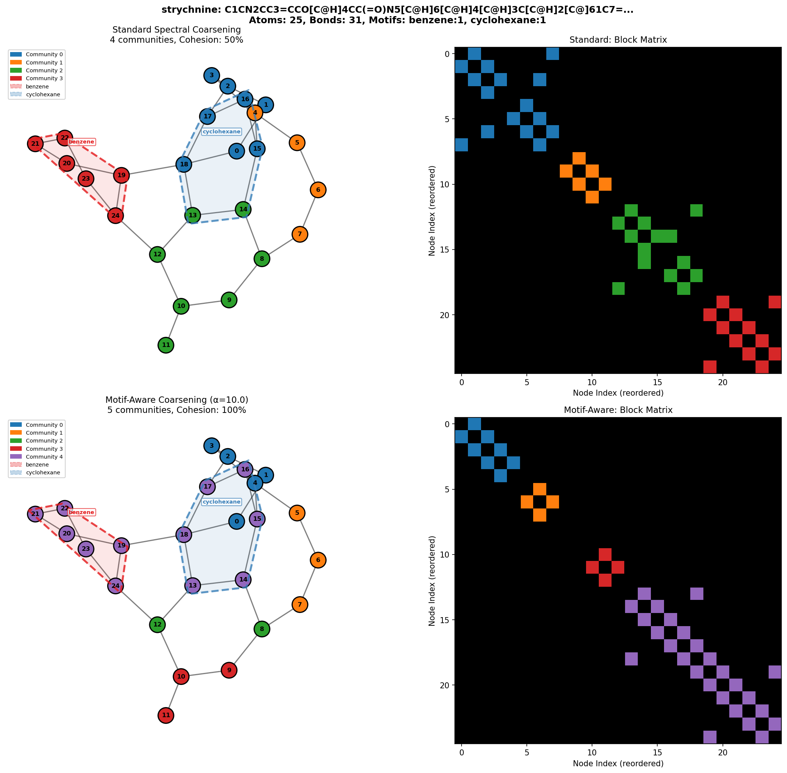
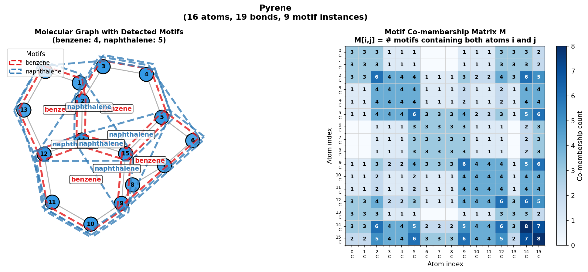

# Visualize Graph Tokenization Schemes

This document describes the graph tokenization systems and how to visualize them.

## Overview

MOSAIC provides four tokenization schemes for converting graphs to sequences:

| Scheme | Description | Key Feature |
|--------|-------------|-------------|
| **SENT** | Flat random walk with back-edges | Simple, baseline |
| **H-SENT** | Hierarchical with explicit partition blocks | Interpretable structure |
| **HDT** | Hierarchical DFS with implicit nesting | ~45% fewer tokens |
| **HDTC** | Compositional with functional groups | Guarantees chemical motif preservation |

## Visualization

### Quick Start: Compare Tokenization Schemes

```bash
conda activate mosaic

# Compare SENT, H-SENT, HDT, and HDTC on a molecule
python scripts/visualization/visualize_tokenization.py --name cholesterol --output-dir ./figures

# Run demo with complex molecules (cholesterol, morphine, caffeine, penicillin)
python scripts/visualization/visualize_tokenization.py --demo --output-dir ./figures

# List available molecules
python scripts/visualization/visualize_tokenization.py --list
```


### Visualization Panels

The comparison shows:

| Panel | Description |
|-------|-------------|
| **Molecule with Motifs** | Original graph with detected ring structures highlighted |
| **SENT** | Random walk traversal with visit order on nodes |
| **H-SENT** | Community structure with cross-community edges |
| **HDT** | Hierarchical tree with bidirectional parent↔child arrows |
| **HDTC** | Two-level functional hierarchy with ring/functional group communities |

Compare standard vs motif-aware coarsening:

```bash
# Compare standard vs motif-aware coarsening
python scripts/visualization/visualize_motif_aware_sc.py --name cholesterol --alpha 10.0
python scripts/visualization/visualize_motif_aware_sc.py --demo --output-dir ./figures
```



Visualize the $M$ matrix:

```bash
# Custom SMILES
python scripts/visualization/visualize_motif_m_matrix.py --smiles "c1ccc2ccccc2c1" --name naphthalene

# Demo with 9 complex molecules
python scripts/visualization/visualize_motif_m_matrix.py --demo --output-dir ./figures

# List all molecules with motif counts
python scripts/visualization/visualize_motif_m_matrix.py --list

# Normalize M by motif size (prevents large motifs from dominating)
python scripts/visualization/visualize_motif_m_matrix.py --name cholesterol --normalize
```



### Generation Demo

Visualize step-by-step molecule generation with animated comparisons:

```bash
# Generate animation comparing tokenization schemes
python scripts/visualization/generation_demo.py --name cholesterol --output cholesterol_gen.gif
```

## References
- [HiGen: Hierarchical Graph Generative Networks](https://arxiv.org/abs/2305.19337) - Hierarchical decomposition approach
- [AutoGraph](https://arxiv.org/abs/2306.10310) - SENT tokenization scheme
