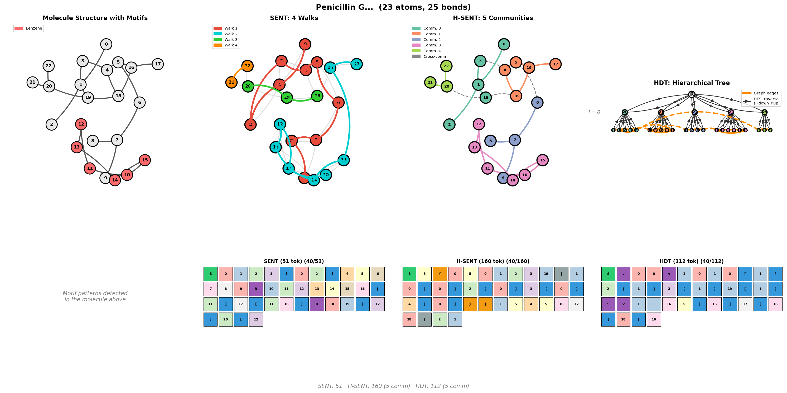
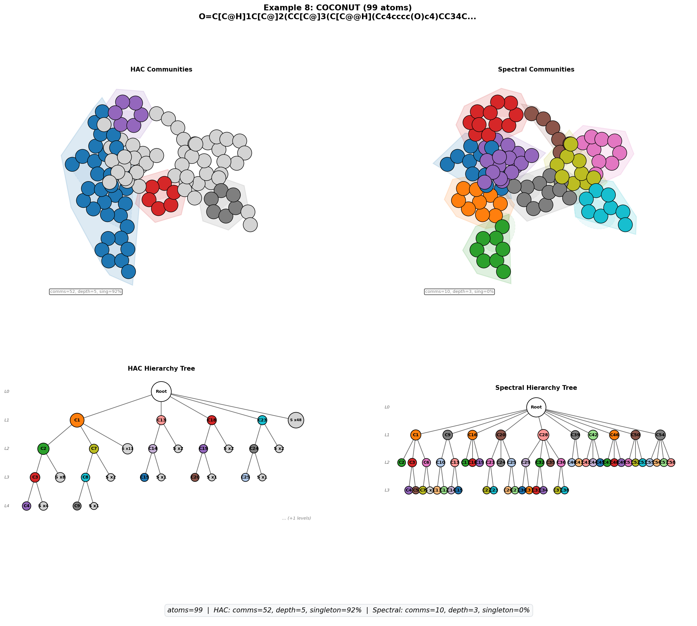

# Visualize Graph Tokenization Schemes

This document describes the graph tokenization systems and how to visualize them.

## Overview

MOSAIC provides four tokenization schemes for converting graphs to sequences:

| Scheme | Description | Key Feature |
|--------|-------------|-------------|
| **SENT** | Flat random walk with back-edges | Simple, baseline |
| **H-SENT** | Hierarchical with explicit partition blocks | Interpretable structure |
| **HDT** | Hierarchical DFS with implicit nesting | ~45% fewer tokens |
| **HDTC** | Compositional with functional groups | Guarantees chemical motif preservation |

## Visualization

### Quick Start: Compare Tokenization Schemes

```bash
conda activate mosaic

# Compare SENT, H-SENT, HDT, and HDTC on a molecule
python scripts/visualization/visualize_tokenization.py --name cholesterol --output-dir ./figures

# Run demo with complex molecules (cholesterol, morphine, caffeine, penicillin)
python scripts/visualization/visualize_tokenization.py --demo --output-dir ./figures

# List available molecules
python scripts/visualization/visualize_tokenization.py --list
```



### Visualization Panels

The comparison shows:

| Panel | Description |
|-------|-------------|
| **Molecule with Motifs** | Original graph with detected ring structures highlighted |
| **SENT** | Random walk traversal with visit order on nodes |
| **H-SENT** | Community structure with cross-community edges |
| **HDT** | Hierarchical tree with bidirectional parent↔child arrows |
| **HDTC** | Two-level functional hierarchy with ring/functional group communities |

### Generation Demo

Visualize step-by-step molecule generation with animated GIFs. Uses Hydra
configuration (`configs/generation_demo.yaml`) with per-model entries for
checkpoint path, tokenizer type, and labeled graph settings.

Each tokenizer type has a specialized visualizer:

| Tokenizer | Side Panel | Features |
|-----------|-----------|----------|
| **SENT** | None | Random walk phase tracking |
| **H-SENT** | Block diagram | Partition fill bars, bipartite arrows |
| **HDT** | Abstract tree | Community hierarchy, current-community highlight |
| **HDTC** | Typed abstract tree | R/F/S type labels, type-based coloring |

All tokenizers support motif detection (ring and functional group highlighting)
via `FunctionalGroupDetector`, with progressive reveal as atoms/edges appear.

```bash
# Default: generate with models listed in configs/generation_demo.yaml
python scripts/visualization/generation_demo.py

# Override generation settings
python scripts/visualization/generation_demo.py generation.num_samples=5 animation.fps=3

# Change output directory
python scripts/visualization/generation_demo.py output.dir=outputs/my_demo

# Disable motif highlighting
python scripts/visualization/generation_demo.py motif.enabled=false

# Single model override (HDTC example)
python scripts/visualization/generation_demo.py \
    'models=[{name: my_hdtc, checkpoint_path: outputs/train/hdtc/best.ckpt, tokenizer_type: hdtc, labeled_graph: true}]'
```

### Community Structure Comparison (HAC vs Spectral)

Compare how HAC (Affinity Coarsening) and Spectral Coarsening partition molecules
across MOSES (simple drug-like) and COCONUT (complex natural products) datasets.

Produces two types of figures:
- **Example progression figures**: configurable number of molecules with evenly-spaced atom counts (small→large), each a 2x2 grid showing molecule+community overlay and hierarchy tree for both HAC and Spectral.
- **Aggregate statistics figure**: 2x3 grid comparing hierarchy depth, community count, largest community size, singleton fraction, non-singleton sizes, and depth vs atom count.

Example molecules are automatically selected to span the full atom count range across both datasets using evenly-spaced targets. Use `--num-examples` to control how many.

```bash
# Default run (200 molecules/dataset, 4 examples, outputs to tmp/)
python scripts/visualization/compare_community_structure.py --no-show

# Generate 8 examples spanning the full atom count range (17→99 atoms)
python scripts/visualization/compare_community_structure.py \
    --num-examples 8 \
    --no-show

# Adjust coarsening granularity
python scripts/visualization/compare_community_structure.py \
    --min-community-size 6 \
    --no-show
```


## References
- [HiGen: Hierarchical Graph Generative Networks](https://arxiv.org/abs/2305.19337) - Hierarchical decomposition approach
- [AutoGraph](https://arxiv.org/abs/2306.10310) - SENT tokenization scheme
